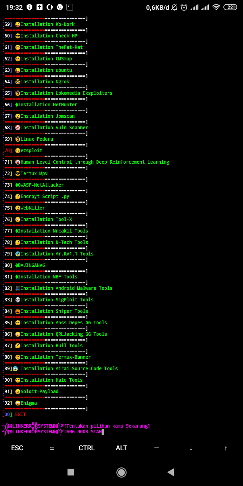

# tools
recode besok emaknya mati 😒

tools milik THCA

# cara pake tools
```
$ pkg update
$ pkg inst python2
$ pkg ins git
$ pkg ins toilet
$ pkg ins ruby
$ git clone https://github.com/mrlinkerrorsystem/tools/
$ cd tools
$ ls
$ sh Toolshack2.sh
```



 Note Idnya Mrlink
 Pwnya ganteng
 tinggal tunggu doang penginstallan toolsnya
 see you iang noob stah ^_^
